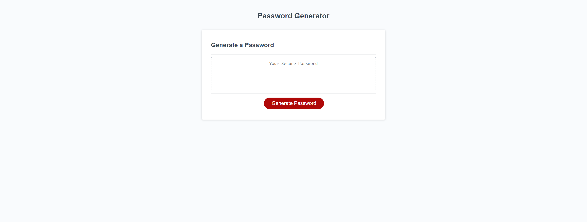

# Password-Generator
Module 3 Password Generator

- Had to create a Password generator from scratch.
- First had to start with creating function variables for each character including upper and lower case letters, and numbers and special characters as well.
-As it was said to have prompts to ask for the password criteria I also made new variables to ask the content user for length, and character that will be used in said password.
-Created 'If' statements do decide what the password will contain when the prompts have been answered from content user.
-And set it so there is a limit in the amount of characters used.

[PasswordGenerator]()